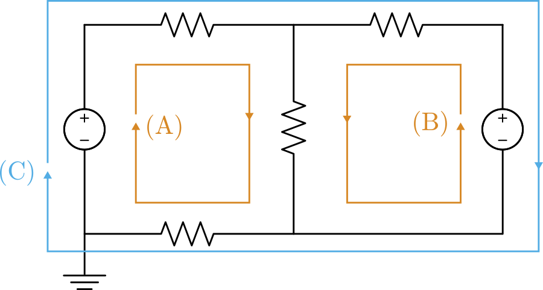
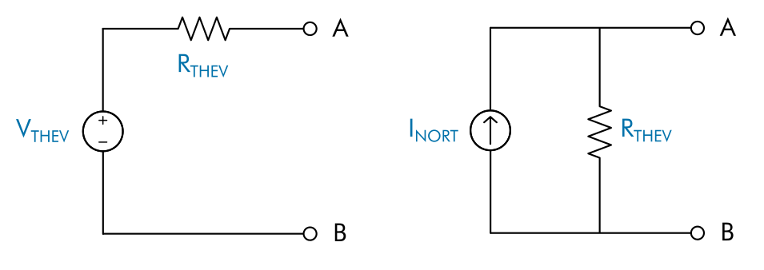
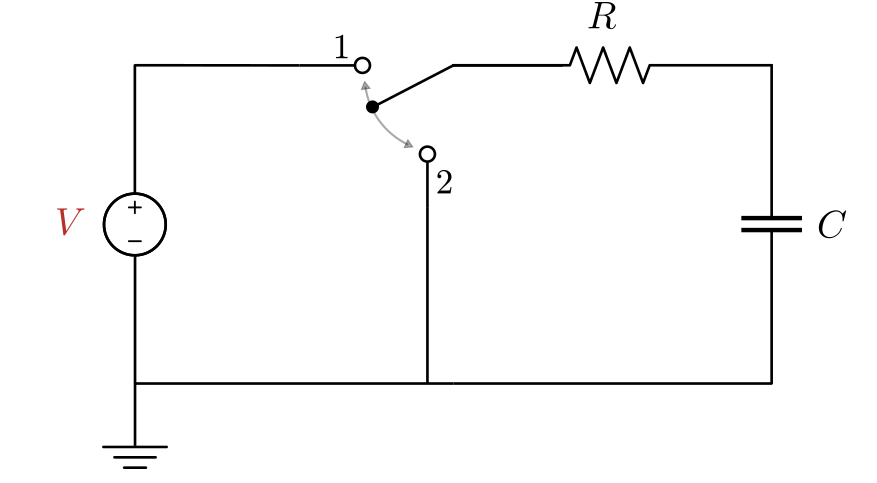
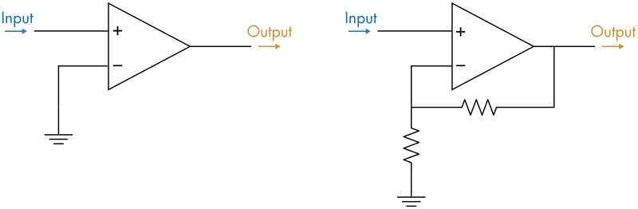

# DC Circuit Analysis

 or 

**Curriculum Module**

_Created with R2021b. Compatible with R2021b and later releases._

# Information

This curriculum module contains interactive [MATLAB® live scripts](https://www.mathworks.com/products/matlab/live-editor.html) and [Simscape™](https://www.mathworks.com/products/simscape.html) models that teaches the fundamental concepts of DC circuits.

## Background

You can use these live scripts as demonstrations in lectures, class activities, or interactive assignments outside class. DC Circuit Analysis covers topics such as mesh analysis, nodal analysis, thevenin circuits, RL circuits, RLC circuits, and op amps. It also includes an application of a virtual oscilloscope to perform measurements of the variety of DC circuits.

The instructions inside the live scripts will guide you through the exercises and activities. Get started with each live script by running it one section at a time. To stop running the script or a section midway (for example, when an animation is in progress), use the  Stop button in the **RUN** section of the **Live Editor** tab in the MATLAB Toolstrip.

## Contact Us

Solutions are available upon instructor request. Contact the [MathWorks teaching resources team](mailto:onlineteaching@mathworks.com) if you would like to request solutions, provide feedback, or if you have a question.

## Prerequisites

This module assumes knowledge of basic ciruit theory and standard electrical circuit notation. There is minimal MATLAB and Simscape knowledge required for these scripts, but you could use [MATLAB Onramp](https://matlabacademy.mathworks.com/details/matlab-onramp/gettingstarted) and [Circuit Simulation Onramp](https://matlabacademy.mathworks.com/details/circuit-simulation-onramp/circuits) as a resource to acquire familiarity with MATLAB syntax, live scripts, and models.

## Getting Started
### Accessing the Module
### **On MATLAB Online:**

Use the  link to download the module. You will be prompted to log in or create a MathWorks account. The project will be loaded, and you will see an app with several navigation options to get you started.

### **On Desktop:**

Download or clone this repository. Open MATLAB, navigate to the folder containing these scripts and double-click on [DCCircuitAnalysis.prj](https://matlab.mathworks.com/open/github/v1?repo=MathWorks-Teaching-Resources/DC-Circuit-Analysis&project=DCCircuitAnalysis.prj). It will add the appropriate files to your MATLAB path and open an app that asks you where you would like to start. 

Ensure you have all the required products ([listed below](#H_E850B4FF)) installed. If you need to include a product, add it using the Add-On Explorer. To install an add-on, go to the **Home** tab and select   **Add-Ons** > **Get Add-Ons**. 

## Products

 *MATLAB* is used throughout. Tools from *Simulink®, Simscape, Simscape Electrical™, and DSP System Toolbox*™ are used frequently as well.

# Scripts

 *If you are viewing this in a version of MATLAB prior to R2023b, you can view the learning outcomes for each script* [*here*](https://www.mathworks.com/matlabcentral/fileexchange/103375-dc-circuit-analysis)

## [**MeshAnalysis.mlx**](https://matlab.mathworks.com/open/github/v1?repo=MathWorks-Teaching-Resources/DC-Circuit-Analysis&project=DCCircuitAnalysis.prj&file=MeshAnalysis.mlx)
|  | **In this script, students will...** | **Academic disciplines**  |
| :-- | :-- | :-- |
|  |  • Use mesh analysis to compute currents through a linear circuit.  • Solve the matrix form of circuit equations in MATLAB.  • Model and analyze linear circuits in Simscape. | • Electrical Engineering  |

## [**NodalAnalysis.mlx**](https://matlab.mathworks.com/open/github/v1?repo=MathWorks-Teaching-Resources/DC-Circuit-Analysis&project=DCCircuitAnalysis.prj&file=NodalAnalysis.mlx)
|  | **In this script, students will...** | **Academic disciplines**  |
| :-- | :-- | :-- |
|  |   • Use nodal analysis to compute voltages.  • Solve the matrix form of circuit equations in MATLAB.  • Model and analyze linear circuits in Simscape. | • Electrical Engineering  |

## [**TheveninNorton.mlx**](https://matlab.mathworks.com/open/github/v1?repo=MathWorks-Teaching-Resources/DC-Circuit-Analysis&project=DCCircuitAnalysis.prj&file=TheveninNorton.mlx)
|  | **In this script, students will...** | **Academic disciplines**  |
| :-- | :-- | :-- |
|  |   • Explain Thevenin and Norton equivalent circuits.  • Solve for Thevenin and Norton equivalents.  • Compare circuits to their Thevenin and Norton equivalents. | • Electrical Engineering  |

## [**RCCircuits.mlx**](https://matlab.mathworks.com/open/github/v1?repo=MathWorks-Teaching-Resources/DC-Circuit-Analysis&project=DCCircuitAnalysis.prj&file=RCCircuits.mlx)
|  | **In this script, students will...** | **Academic disciplines**  |
| :-- | :-- | :-- |
|  |   • Simulate charging and discharging RC circuits.  • Plot solutions of RC circuit differential equations.  • Measure the time constant of an RC circuit. | • Electrical Engineering  |

## [**RLCCircuits.mlx**](https://matlab.mathworks.com/open/github/v1?repo=MathWorks-Teaching-Resources/DC-Circuit-Analysis&project=DCCircuitAnalysis.prj&file=RLCCircuits.mlx)
|  | **In this script, students will...** | **Academic disciplines**  |
| :-- | :-- | :-- |
|  |   • Compare the response of first and second order circuits.  • Analyze a second order RLC circuit differential equation.  • Solve for the natural frequency and damping in an RLC circuit.  • Compare underdamped, overdamped, and critically damped circuits. | • Electrical Engineering  |

## [**OpAmps.mlx**](https://matlab.mathworks.com/open/github/v1?repo=MathWorks-Teaching-Resources/DC-Circuit-Analysis&project=DCCircuitAnalysis.prj&file=OpAmps.mlx)
|  | **In this script, students will...** | **Academic disciplines**  |
| :-- | :-- | :-- |
|  |   • Describe the open-loop behavior of an op amp.  • Compare ideal and non-ideal op amp behavior.  • Analyze negative feedback op amp circuits.  • Design circuits using combinations of basic op amp circuits. | • Electrical Engineering  |

# How-To Videos

These short videos demonstrate some of the basic techniques used to simulate and measure circuits in the module.

-  [Building a Circuit](https://github.com/MathWorks-Teaching-Resources/DC-Circuit-Analysis#building-a-circuit) 
-  [Analyzing with a Multimeter](https://github.com/MathWorks-Teaching-Resources/DC-Circuit-Analysis#analyzing-with-a-multimeter) 
-  [Demonstrating Oscilloscope Operation](https://github.com/MathWorks-Teaching-Resources/DC-Circuit-Analysis#demonstrating-oscilloscope-operation) 

# License

The license for this module is available in the [LICENSE.md](https://github.com/MathWorks-Teaching-Resources/DC-Circuit-Analysis/blob/release/LICENSE.md).

# Related Courseware Modules

Feel free to explore our other [modular courseware content](https://www.mathworks.com/matlabcentral/fileexchange/?q=tag%3A%22courseware+module%22&sort=downloads_desc_30d).

# Educator Resources
-  [Educator Page](https://www.mathworks.com/academia/educators.html) 

# Contribute 

Looking for more? Find an issue? Have a suggestion? Please contact the [MathWorks teaching resources team](mailto:%20onlineteaching@mathworks.com). If you want to contribute directly to this project, you can find information about how to do so in the [CONTRIBUTING.md](https://github.com/MathWorks-Teaching-Resources/DC-Circuit-Analysis/blob/release/CONTRIBUTING.md) page on GitHub.

 *©* Copyright 2023 The MathWorks™, Inc

